#--
## "Российский Университет Дружбы Народов
#title: "Архитектура компьютеров"
#subtitle: "Лабораторная работа №4"
#author: "Хамдамова Айжана"

# "Содержание":
1. Цель работы 
2. Ход работы
3. Самостоятельная работа 
4. Вывод

# Цель работы
Освоение процедуры компиляции и сборки программ, написанных на ассемблере NASM

# Выполнение лабораторной работы
### 1.Сначала я создала каталог для работы с программами на языке ассемблера NASM:
mkdir ~/work/arch-pc/lab05
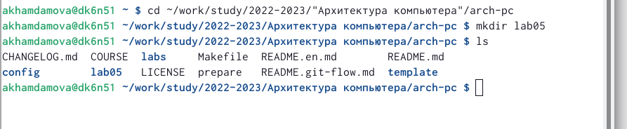
(но потом я не дочитав до конца всю лабораторную работу, сразу перешла в локальный репазиторий в каталог курса ~/work/study/2022-2023/"Архитектура компьютера"/arch-pc/labs/lab05/ и только в конце поняла,что не надо было)
### 2.Создаю текстовый файл с именем hello.asm и открываю этот файл с помощью текстового редактора gedit
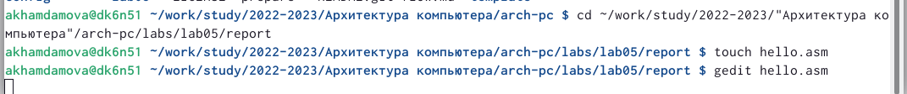
### 3.И ввожу в него следующий текст:
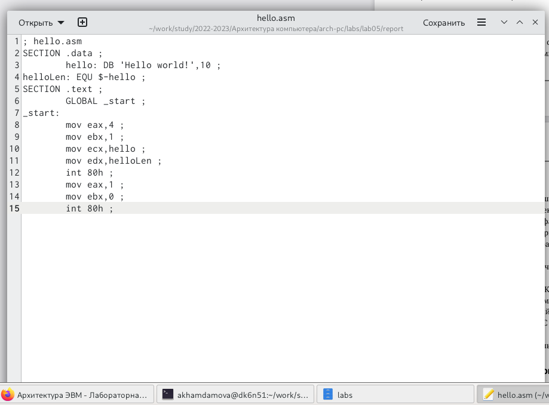
### 4.NASM превращает текст программы в объектный код. Например, для компиляции приведённого выше текста программы «Hello World» необходимо написать:

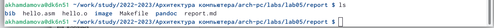
### 5.Нужно выполнить следующую команду и проверить создались ли файлы:
nasm -o obj.o -f elf -g -l list.lst hello.asm
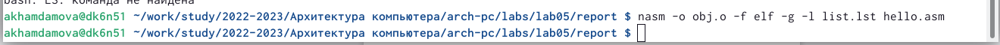
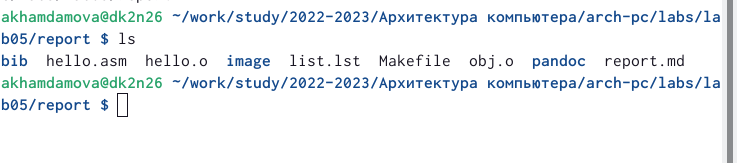
### 6.Чтобы объектный файл передать на обработку компоновщику вводим след. команду:
ld -m elf_i386 hello.o -o hello
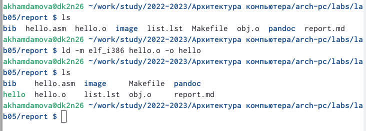
### 7. Следующим шагом нужно ввести команду:
*Ключ -o с последующим значением задаёт в данном случае имя создаваемого исполняемого файла.*
ld -m elf_i386 obj.o -o main
##7/1 Запустить на выполнение созданный исполняемый файл, находящийся в текущем каталоге, можно, набрав в командной строке:
./hello
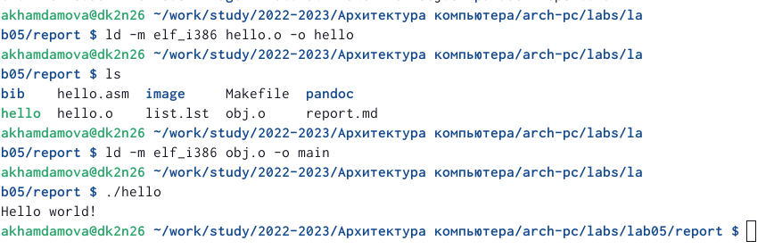

# Самостоятельная работа
### 1) C помощью команды cp создайте копию файла hello.asm с именем lab5.asm
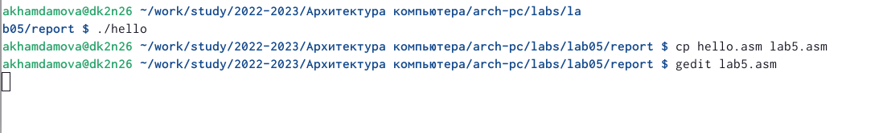
### 2) С помощью текстового редактора вношуизменения в текст программы в файле lab5.asm так, чтобы вместо Hello world! на экран выводилась строка с вашими фамилией и именем.
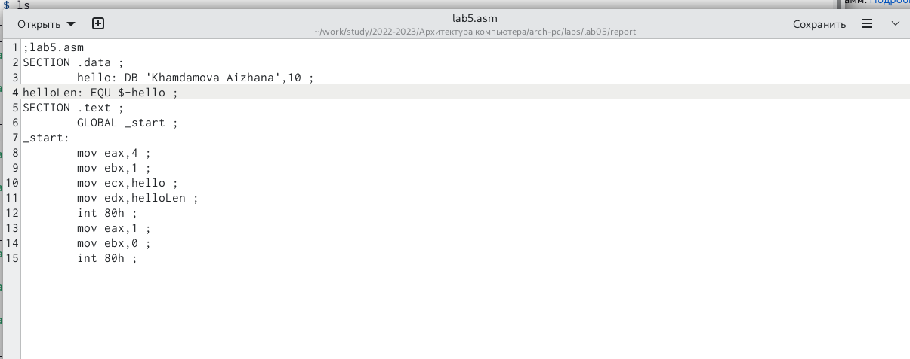
### 3) Оттранслирую полученный текст программы lab5.asm в объектный файл. Затем выполняю компоновку объектного файла и запускаю получившийся исполняемый файл.
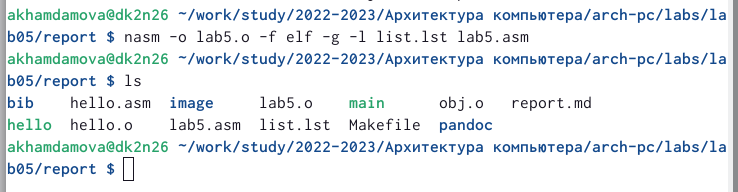
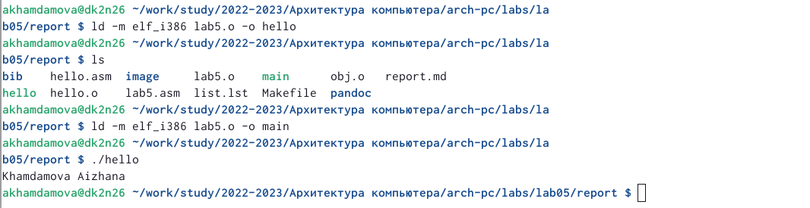
### Затем я компилирую данный отчет в 3 форматаъ и отправляю все эти файлы в репозиторий github
# Вывод: 
С помощью данной лабораторной работы Я смогла освоить процедуры компиляции и сборки программ, написанных на ассемблере NASM

::: {#refs}

