---
## Front matter
title: "Архитектура компьютеров"
subtitle: "Лабораторная работа № 6"
author: "Хамдамова Айжана"

## Generic otions
lang: ru-RU
toc-title: "Содержание"

## Bibliography
bibliography: bib/cite.bib
csl: pandoc/csl/gost-r-7-0-5-2008-numeric.csl

## Pdf output format
toc: true # Table of contents
toc-depth: 2
lof: true # List of figures
lot: true # List of tables
fontsize: 12pt
linestretch: 1.5
papersize: a4
documentclass: scrreprt
## I18n polyglossia
polyglossia-lang:
  name: russian
  options:
	- spelling=modern
	- babelshorthands=true
polyglossia-otherlangs:
  name: english
## I18n babel
babel-lang: russian
babel-otherlangs: english
## Fonts
mainfont: PT Serif
romanfont: PT Serif
sansfont: PT Sans
monofont: PT Mono
mainfontoptions: Ligatures=TeX
romanfontoptions: Ligatures=TeX
sansfontoptions: Ligatures=TeX,Scale=MatchLowercase
monofontoptions: Scale=MatchLowercase,Scale=0.9
## Biblatex
biblatex: true
biblio-style: "gost-numeric"
biblatexoptions:
  - parentracker=true
  - backend=biber
  - hyperref=auto
  - language=auto
  - autolang=other*
  - citestyle=gost-numeric
## Pandoc-crossref LaTeX customization
figureTitle: "Рис."
tableTitle: "Таблица"
listingTitle: "Листинг"
lofTitle: "Список иллюстраций"
lotTitle: "Список таблиц"
lolTitle: "Листинги"
## Misc options
indent: true
header-includes:
  - \usepackage{indentfirst}
  - \usepackage{float} # keep figures where there are in the text
  - \floatplacement{figure}{H} # keep figures where there are in the text
---

# Цель работы

Приобретение практических навыков работы в Midnight Commander. Освоение
инструкций языка ассемблера mov и int.

# Выполнение лабораторной работы
1. Откроем Midmight Commander  с помощью команды: mc (рис. [-@fig:1])

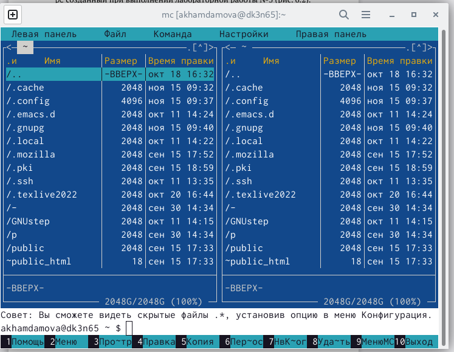{ #fig:1 width=70% }

2. Перехожу в каталог ~/work/arch-pc созданный при выполнении лабораторной работы №5 (рис. [-@fig:2])

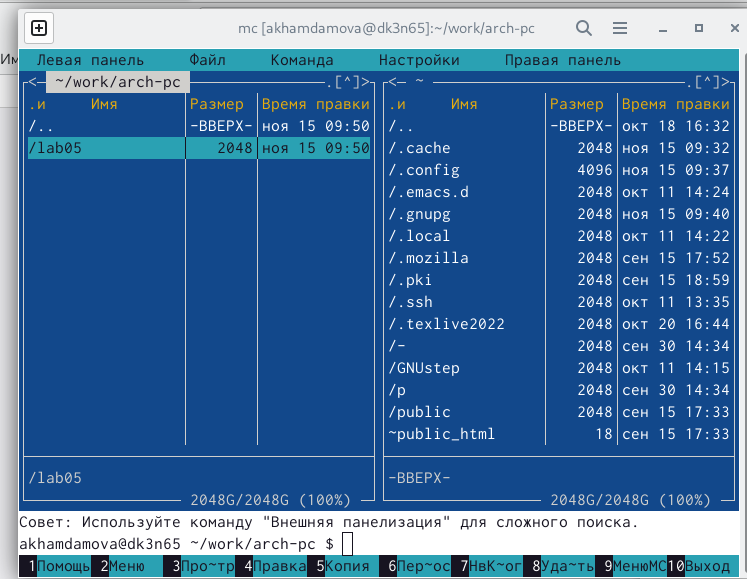{ #fig:2 width=70% }
3. С помощью функциональной клавиши F7 создаю папку lab06 и перехожу в созданный каталог (рис. [-@fig:3])

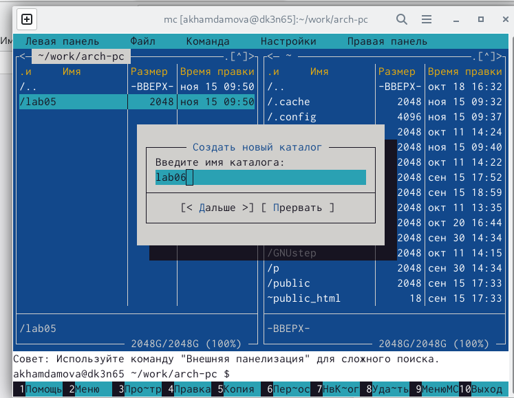{ #fig:3 width=70% }

4. Пользуясь строкой ввода и командой touch создаю файл lab6-1.asm (рис. [-@fig:4]) 

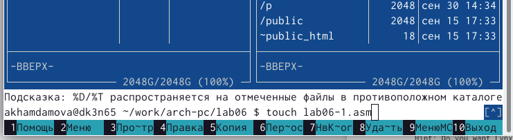{ #fig:4 width=70% }

5. С помощью функциональной клавиши F4 открываю файл lab6-1.asm для редактирования во встроенном редакторе mcedit. Далее ввожу текст программы из листинга 6.1 (рис. [-@fig:5.1])

 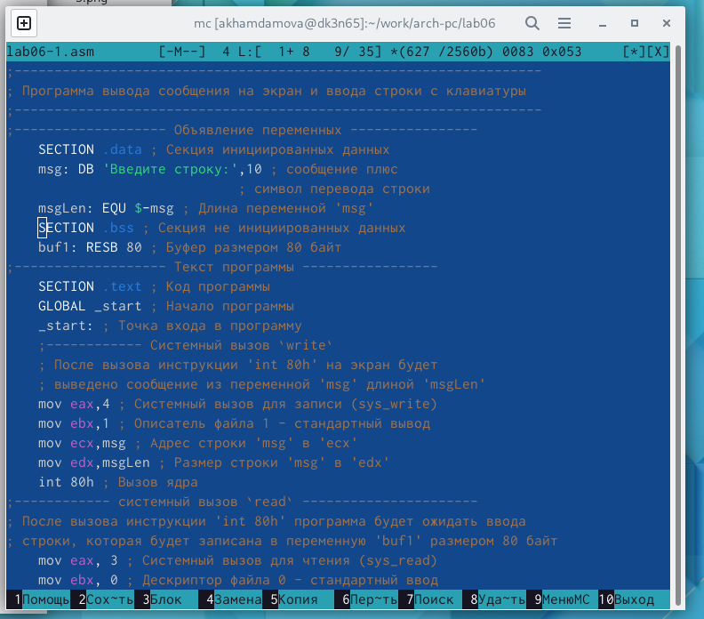{ #fig:5.1 width=70% }

 6. С помощью функциональной клавиши F3 открываю файл lab6-1.asm для просмотра. Убеждаюсь, что файл содержит текст программы (рис. [-@fig:5.2])

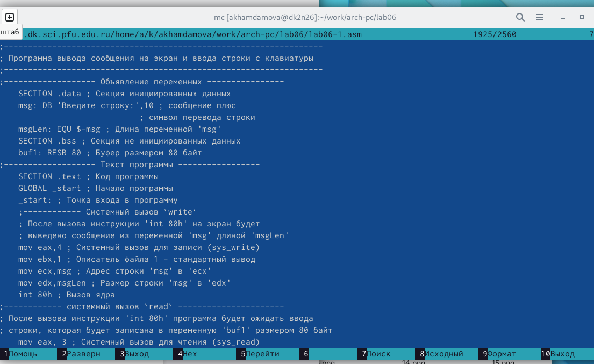{ #fig:5.2 width=70% }

7. Оттранслирую текст программы lab6-1.asm в объектный файл. (рис. [-@fig:6])Далее выполняю компоновку объектного файла и запускаю получившийся исполняемый файл. Программа выводит строку 'Введите строку:' и ожидает ввода с клавиатуры. (рис. [-@fig:7])

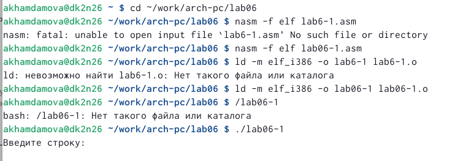{ #fig:6 width=70% }

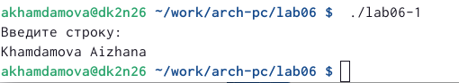{ #fig:7 width=70% }

8. Скачиваю файл in_out.asm со страницы курса в ТУИС.(рис. [-@fig:8])
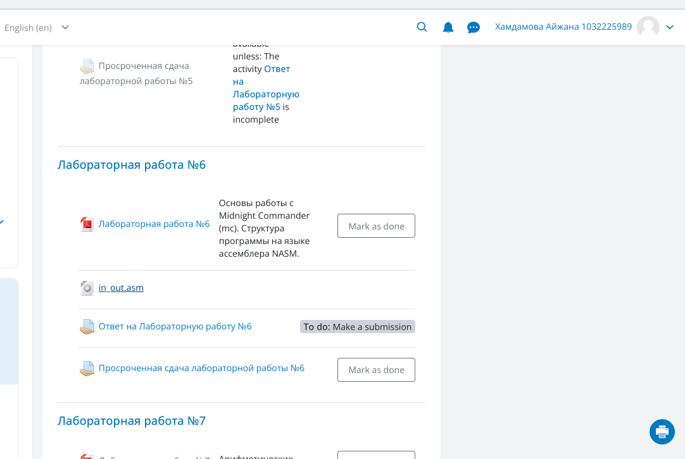{ #fig:8 width=70% }

9. Подключаемый файл in_out.asm должен лежать в том же каталоге, что и файл с программой, в которой он используется. В одной из панелей mc открываю каталог с файлом lab6-1.asm  В другой панели каталог "Загрузки" с in_out.asm (для перемещения между панелями используйте Tab ). Копирую файл in_out.asm в каталог с файлом lab6-1.asm с помощью функциональной клавиши F5) (рис. [-@fig:9]) (рис. [-@fig:10])

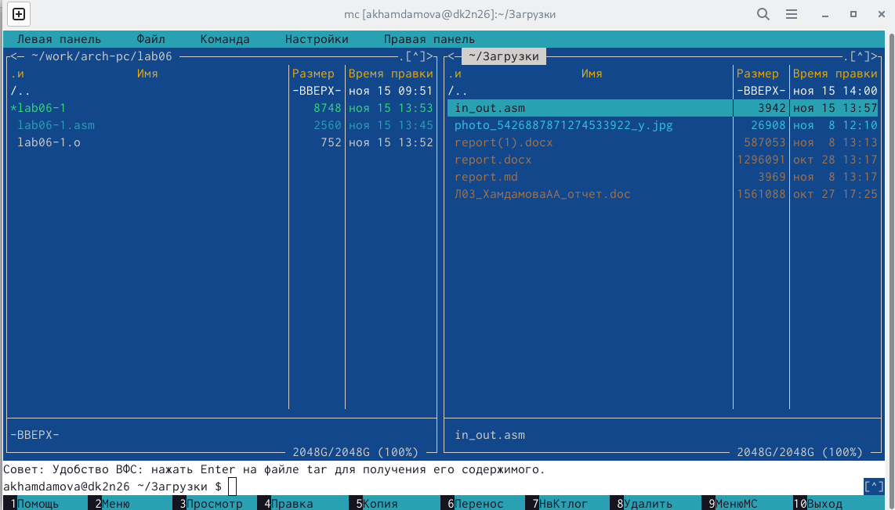{ #fig:9 width=70% }

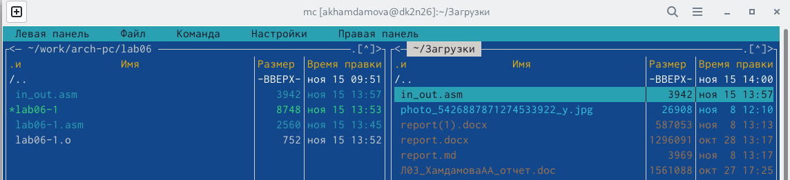{ #fig:10 width=70% }

10. С помощью функциональной клавиши F5 создаю копию файла lab6- 1.asm с именем lab6-2.asm. Выделяю файл lab6-1.asm, нажимаю клавишу F6 , ввожу имя файла lab6-2.asm и нажимаю клавишу Enter. )(рис. [-@fig:11])

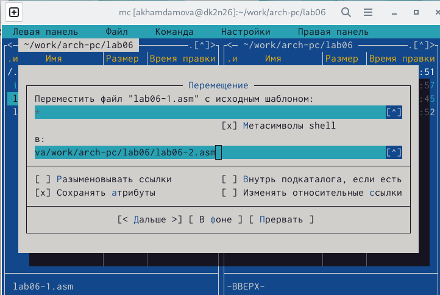{ #fig:11 width=70% }

11. Исправляю текст программы в файле lab6-2.asm с использование подпрограмм из внешнего файла in_out.asm в соответствии с листингом 6.2. )(рис. [-@fig:12]) Создаю исполняемый файл и проверяю его работу)(рис. [-@fig:13])

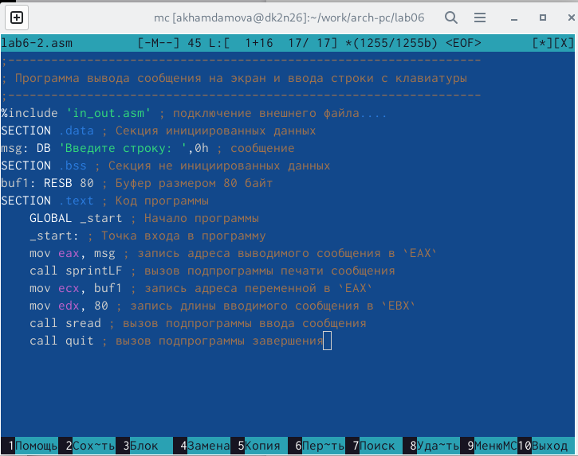{ #fig:12 width=70% } 

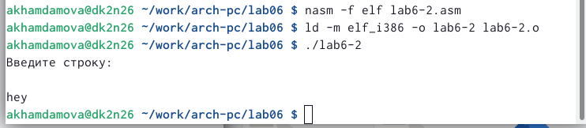{ #fig:13 width=70% } 

12. В файле lab6-2.asm заменяю подпрограмму sprintLF на sprint.(рис. [-@fig:14]) Создаю исполняемый файл и проверяю его работу.)(рис. [-@fig:15])

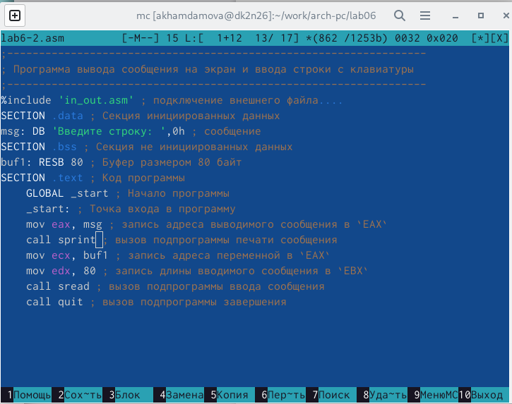{ #fig:14 width=70% } 

{ #fig:15 width=70% } 
# Задание для самостоятельной работы

1.Создаю копию файла lab6-1.asm. Вношу изменения в программу аналогично как и в первом шаге.(без
использования внешнего файла in_out.asm).) (рис. [-@fig:16])
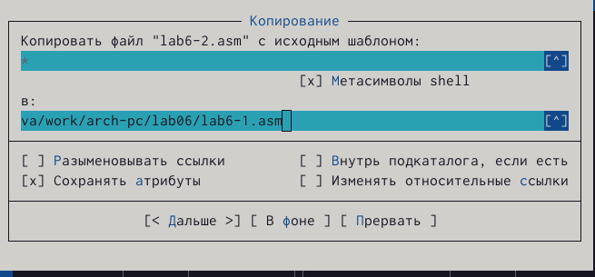{ #fig:16 width=70% } 

# Выводы

Я приобрела практических навыков работы в Midnight Commander. Освоила инструкций языка ассемблера mov и int.

# Список литературы{.unnumbered}

::: {#refs}
:::
