---
## Front matter
title: "Архитектура компьютеров"
subtitle: "Лабораторная работа №7"
author: "Хамдамова Айжана"

## Generic otions
lang: ru-RU
toc-title: "Содержание"

## Bibliography
bibliography: bib/cite.bib
csl: pandoc/csl/gost-r-7-0-5-2008-numeric.csl

## Pdf output format
toc: true # Table of contents
toc-depth: 2
lof: true # List of figures
lot: true # List of tables
fontsize: 12pt
linestretch: 1.5
papersize: a4
documentclass: scrreprt
## I18n polyglossia
polyglossia-lang:
  name: russian
  options:
	- spelling=modern
	- babelshorthands=true
polyglossia-otherlangs:
  name: english
## I18n babel
babel-lang: russian
babel-otherlangs: english
## Fonts
mainfont: PT Serif
romanfont: PT Serif
sansfont: PT Sans
monofont: PT Mono
mainfontoptions: Ligatures=TeX
romanfontoptions: Ligatures=TeX
sansfontoptions: Ligatures=TeX,Scale=MatchLowercase
monofontoptions: Scale=MatchLowercase,Scale=0.9
## Biblatex
biblatex: true
biblio-style: "gost-numeric"
biblatexoptions:
  - parentracker=true
  - backend=biber
  - hyperref=auto
  - language=auto
  - autolang=other*
  - citestyle=gost-numeric
## Pandoc-crossref LaTeX customization
figureTitle: "Рис."
tableTitle: "Таблица"
listingTitle: "Листинг"
lofTitle: "Список иллюстраций"
lotTitle: "Список таблиц"
lolTitle: "Листинги"
## Misc options
indent: true
header-includes:
  - \usepackage{indentfirst}
  - \usepackage{float} # keep figures where there are in the text
  - \floatplacement{figure}{H} # keep figures where there are in the text
---

# Цель работы

Освоение арифметических инструкций языка ассемблера NASM.

# Выполнение лабораторной работы

1. Я создала каталог для программам лабораторной работы No 7, перешла в
него и создала файл lab7-1.asm (рис. [-@fig:001])

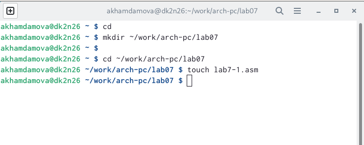{ #fig:001 width=70% }

2. Ввожу в файл lab7-1.asm текст программы из листинга 7.1 (рис. [-@fig:002])

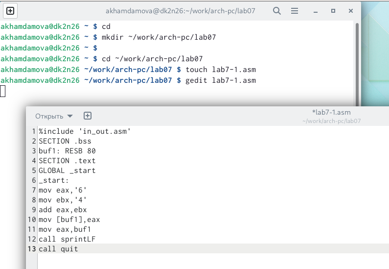{ #fig:002 width=70% }

3. Создаю исполняемый файл и запускаю его (рис. [-@fig:003])

{ #fig:003 width=70% }

4. Далее изменим текст программы и место символов, запишем в реги-
стры числа (рис. [-@fig:004]) , запускаем файл.(рис. [-@fig:005])

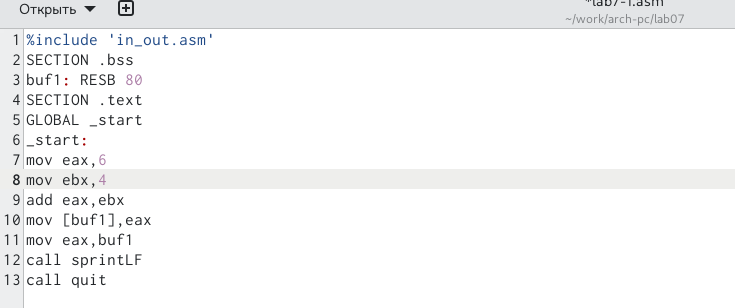{ #fig:004 width=70% }

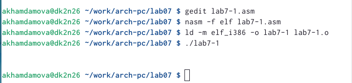{ #fig:005 width=70% }

5. Создаю файл lab7-2.asm в каталоге ~/work/arch-pc/lab07 (рис. [-@fig:006]) и ввожу в него
текст программы из листинга 7.2.(рис. [-@fig:007])

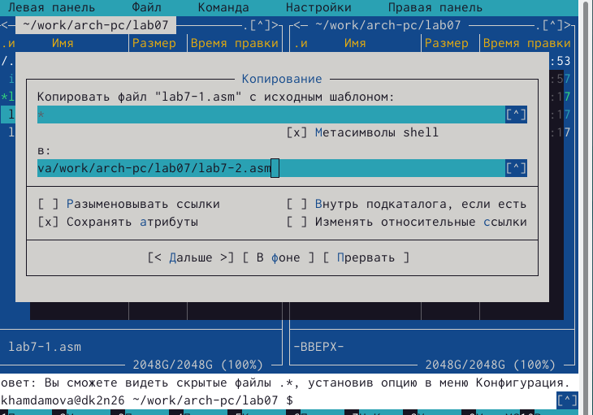{ #fig:006 width=70% }

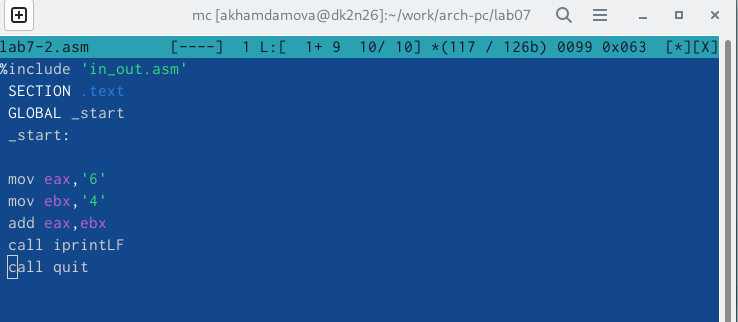{ #fig:007 width=70% }

6. Запускаю файл(рис. [-@fig:008])

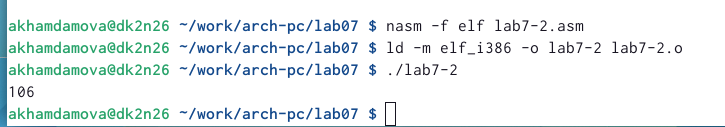{ #fig:008 width=70% }

7. Аналогично предыдущему примеру меняю символы на числа и запускаю файл (рис. [-@fig:009]) (рис. [-@fig:010]) 

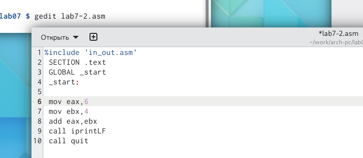{ #fig:009 width=70% }

{ #fig:010 width=70% }

8. Создаю файл lab7-3.asm в каталоге ~/work/arch-pc/lab07:(рис. [-@fig:011])

{ #fig:011 width=70% }

9. программу листинга 7.3  ввожу в lab7-3.asm (рис. [-@fig:012]) и запускаю (рис. [-@fig:013]) 

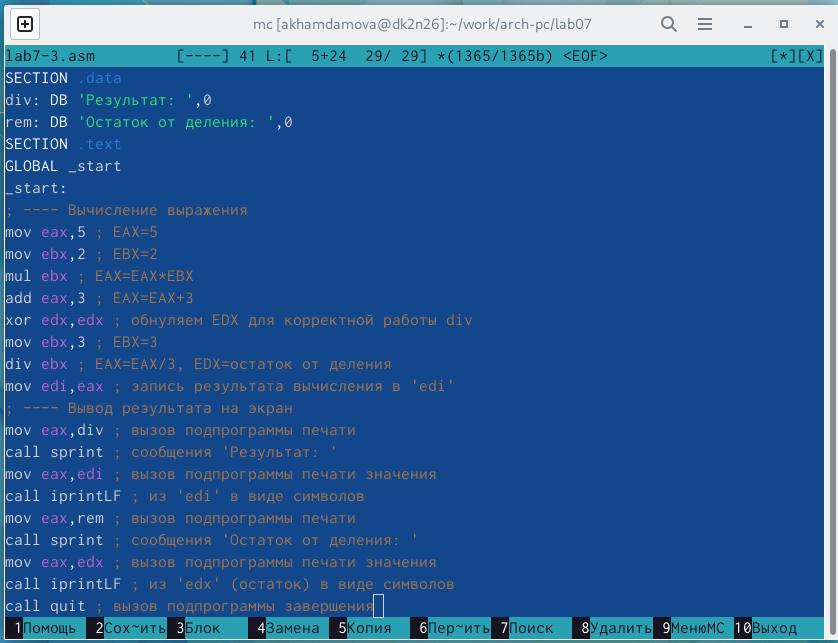{ #fig:012 width=70% }

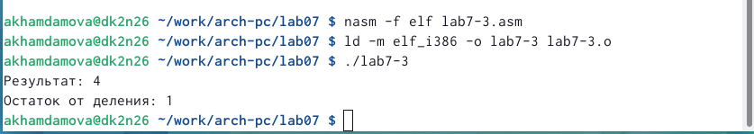{ #fig:013 width=70% }

10. Меняю текст программы для вычисления выражения 𝑓(𝑥) = (4 ∗ 6 + 2)/5. (рис. [-@fig:014])
Создаю исполняемый файл и проверяю его работу.(рис. [-@fig:015])

{ #fig:014 width=70% }

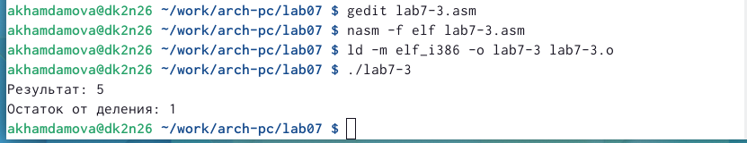{ #fig:015 width=70% }

11. Создала файл variant.asm (рис. [-@fig:016]) и ввожу туда файл из листинга 7.4. Затем компилирую его и запускаю (рис. [-@fig:017]) 

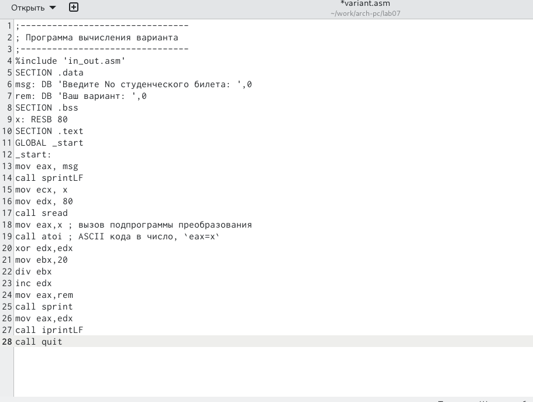{ #fig:016 width=70% }

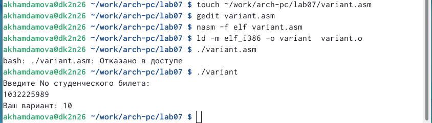{ #fig:017 width=70% }

ОТВЕТЫ НА ВОПРОСЫ:
1) mov eax,rem call sprint
2)Ввод переменной x
3)Преобразует строку string  в целое значение типа int
4)xor edx, edx mov ebx, 20 div ebx inc edx
5) В mov edi, eax 
6) inc увеличивает на 1 свой операнд 
7)mov eax, edx call iprintLF

# Самостоятельная работа 
1. У меня вариант 10. Пишу программу (рис. [-@fig:018]) , создаю файл, запускаю его. 
10) 5(𝑥 + 18) − 28, x1=2, x2=3 (рис. [-@fig:019])

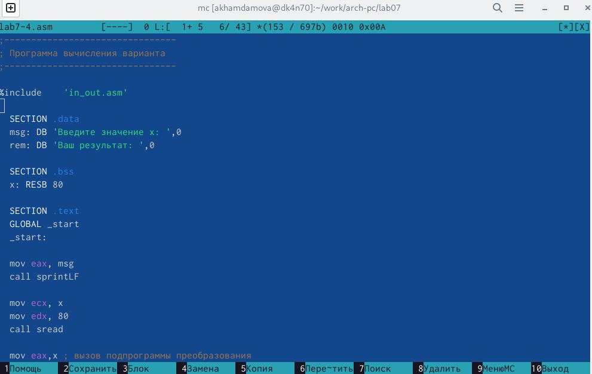{ #fig:018 width=70% }

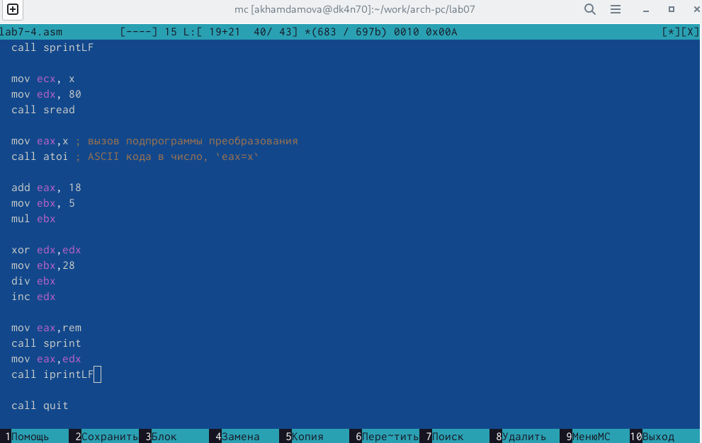{ #fig:019 width=70% }

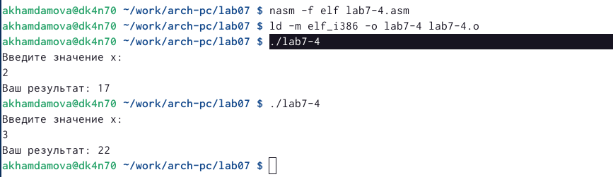

# Выводы

Я научилась работать с ассемблером NASM. 

# Список литературы{.unnumbered}

::: {#refs}
:::
